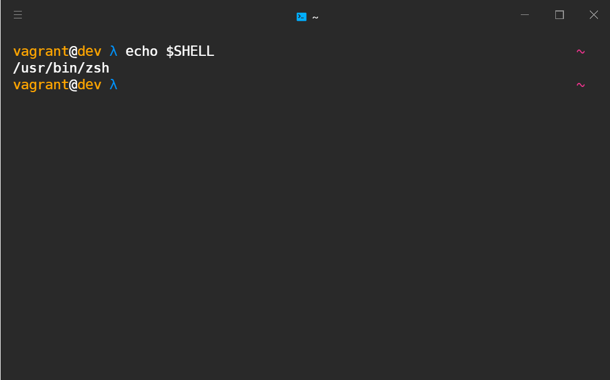

# zsh

[Zsh](https://github.com/ohmyzsh/ohmyzsh/wiki/Installing-ZSH)

```bash
sudo apt install -y zsh
sudo chsh -s $(which zsh) #vagrant
```

```bash
sh -c "$(curl -fsSL https://raw.github.com/ohmyzsh/ohmyzsh/master/tools/install.sh)"
```

## Theme

[typewritten](https://typewritten.dev/#/installation?id=oh-my-zsh)

```bash
git clone https://github.com/reobin/typewritten.git $ZSH_CUSTOM/themes/typewritten
ln -s "$ZSH_CUSTOM/themes/typewritten/typewritten.zsh-theme" "$ZSH_CUSTOM/themes/typewritten.zsh-theme"
ln -s "$ZSH_CUSTOM/themes/typewritten/async.zsh" "$ZSH_CUSTOM/themes/async"
```

`.zshrc`

```bash
ZSH_THEME="typewritten"
```

`.zprofile`

```bash
# typewritten
export TYPEWRITTEN_SYMBOL="λ"
export TYPEWRITTEN_PROMPT_LAYOUT="singleline_verbose"
```


